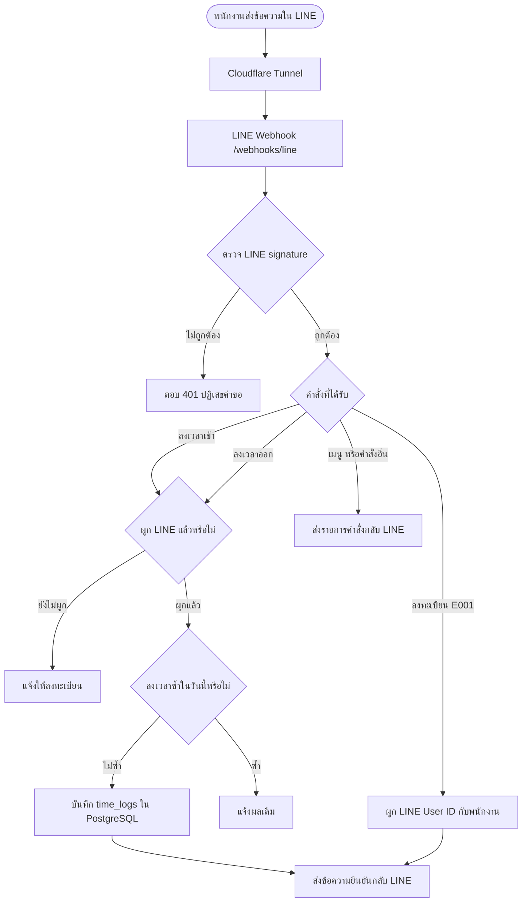

# เอกสารส่งมอบระบบ TimeWork LINE

วันที่ส่งมอบ: 4 กันยายน 2569

## สรุประบบ

TimeWork เป็นระบบต้นแบบบันทึกเวลาเข้าและออกงานผ่าน LINE Messaging API มีหน้า Dashboard สำหรับจัดการพนักงาน และจัดเก็บข้อมูลใน PostgreSQL

ระบบกำลังทำงานบนเซิร์ฟเวอร์ Ubuntu ที่ `192.168.0.157` ภายใต้ผู้ใช้ `aon` โดยใช้ Docker Compose

## Flowchart การลงเวลาผ่าน LINE




## จุดเข้าใช้งาน

| รายการ | ที่อยู่ |
| --- | --- |
| Dashboard และ API ผ่านอินเทอร์เน็ต | `https://timework.scriptbin.dev/` |
| LINE Webhook | `https://timework.scriptbin.dev/webhooks/line` |
| Dashboard ภายในเครือข่าย | `http://192.168.0.157:3000/` |
| Health check | `https://timework.scriptbin.dev/health` |

## โฟลเดอร์และบริการ

โค้ดและไฟล์ตั้งค่าอยู่ที่ `/home/aon/timework-line`

Docker Compose มี 2 บริการ

- `api` เป็น Node.js TypeScript และ Fastify เปิดพอร์ต 3000
- `db` เป็น PostgreSQL 16 เปิดใช้เฉพาะภายใน Docker network

ข้อมูลฐานข้อมูลอยู่ใน Docker volume ชื่อ `timework-line_timework_postgres`

## การตั้งค่า secret

ไฟล์ `/home/aon/timework-line/.env` เก็บค่าลับและมีสิทธิ์เข้าถึงเฉพาะเจ้าของไฟล์ ห้ามนำไฟล์นี้ขึ้น Git หรือส่งผ่านแชต

ตัวแปรสำคัญ

- `POSTGRES_PASSWORD`
- `LINE_CHANNEL_SECRET`
- `LINE_CHANNEL_ACCESS_TOKEN`
- `ADMIN_API_KEY`

เมื่อแก้ไฟล์ `.env` ต้อง recreate API เพื่อให้โหลดค่าใหม่

```bash
cd /home/aon/timework-line
docker compose up -d --force-recreate api
```

## การเข้าสู่ระบบ Dashboard

Dashboard และ `/api` ทุกเส้นทางต้องยืนยันตัวตนด้วย `ADMIN_API_KEY`

เมื่อเปิด `https://timework.scriptbin.dev/` เบราว์เซอร์จะแสดงกล่องให้กรอกชื่อผู้ใช้และรหัสผ่าน

- ชื่อผู้ใช้ ใส่อะไรก็ได้ เช่น `admin` (ระบบตรวจเฉพาะรหัสผ่าน)
- รหัสผ่าน คือค่าของ `ADMIN_API_KEY` ในไฟล์ `.env`

อ่านค่าคีย์บนเซิร์ฟเวอร์ได้ด้วย

```bash
grep ADMIN_API_KEY /home/aon/timework-line/.env
```

การเรียกผ่านสคริปต์หรือ curl ใช้ได้สองแบบ

```bash
curl -H "x-admin-key: $ADMIN_API_KEY" https://timework.scriptbin.dev/api/employees
curl -u admin:$ADMIN_API_KEY https://timework.scriptbin.dev/api/employees
```

เส้นทางที่เปิดไว้โดยไม่ต้องใส่คีย์มีเพียงสองเส้นทาง

- `/health` เพื่อให้ระบบ monitoring ตรวจสถานะได้
- `/webhooks/line` เพราะตรวจ HMAC signature จาก LINE อยู่แล้ว

หากต้องการเปลี่ยนคีย์ ให้แก้ `.env` แล้ว recreate API ตามคำสั่งในหัวข้อการตั้งค่า secret ผู้ใช้ทุกคนต้องกรอกรหัสผ่านใหม่

## การใช้งาน LINE

ใน LINE Developers Console ให้เปิด Use webhook และตั้ง Webhook URL เป็น `https://timework.scriptbin.dev/webhooks/line`

คำสั่งที่ Bot รองรับ

```text
ลงทะเบียน E001
ลงเวลาเข้า
ลงเวลาออก
เมนู
```

เมื่อลงเวลาเข้า บอทจะบอกกะและสถานะสายให้ด้วย ถ้าพนักงานคนนั้นถูกกำหนดกะไว้

ก่อนพนักงานลงทะเบียน ต้องเพิ่มข้อมูลพนักงานใน Dashboard ก่อน เช่น รหัส `E001` จากนั้นพนักงานส่ง `ลงทะเบียน E001` เพื่อผูก LINE User ID กับพนักงาน

## ข้อมูลพนักงาน

หน้า พนักงาน ใน Dashboard เก็บข้อมูลต่อไปนี้ กรอกได้ทั้งตอนเพิ่มพนักงานใหม่และตอนแก้ไขภายหลัง โดยคลิกที่แถวของพนักงาน

| ฟิลด์ | บังคับ | หมายเหตุ |
| --- | --- | --- |
| รหัสพนักงาน | ใช่ | ห้ามซ้ำ และแก้ไขภายหลังไม่ได้ |
| ชื่อ-นามสกุล | ใช่ | |
| เลขที่บัตรประชาชน | ไม่ | 13 หลัก ระบบตรวจ check digit ให้ ใส่ขีดคั่นได้ ห้ามซ้ำกับพนักงานคนอื่น |
| เบอร์โทร | ไม่ | ตัวเลข 9 ถึง 15 หลัก ใส่ขีดหรือวรรคได้ |
| วันที่เริ่มงาน | ไม่ | เลือกจากปฏิทิน |
| เชื้อชาติ | ไม่ | มีตัวเลือกแนะนำ พิมพ์เองได้ |
| ที่อยู่ | ไม่ | |
| แผนก / กลุ่มงาน | ไม่ | ใช้กรองรายงานและค่าจ้าง สร้างแผนกได้ที่หน้าตั้งค่า |
| ประเภทพนักงาน | ไม่ | กำหนดวิธีจ่ายค่าตอบแทน สร้างประเภทได้ที่หน้าตั้งค่า |
| กะการทำงาน | ไม่ | กะประจำ ใช้เมื่อยังไม่ตั้งตารางการทำงาน |
| สถานะการใช้งาน | ไม่ | ปิดเมื่อพนักงานลาออก คนที่ปิดใช้งานจะลงเวลาผ่าน LINE ไม่ได้ |

พนักงานต่างชาติที่ไม่มีบัตรประชาชนไทยให้เว้นช่องเลขที่บัตรประชาชนว่างไว้ เพราะระบบตรวจรูปแบบเลขไทย 13 หลักเท่านั้น

LINE User ID แก้ไขจากหน้ารายละเอียดไม่ได้ พนักงานต้องผูกเองด้วยการพิมพ์ `ลงทะเบียน รหัสพนักงาน` ใน LINE

## กะการทำงาน

หน้า กะการทำงาน ใช้กำหนดเวลาเข้าออกงานและเวลาอนุโลมสาย ระบบจะคิดให้อัตโนมัติว่าพนักงานมาสายกี่นาที

| ฟิลด์ | บังคับ | หมายเหตุ |
| --- | --- | --- |
| ชื่อกะ | ใช่ | ห้ามซ้ำ |
| เวลาเข้างาน | ใช่ | ใช้เป็นเกณฑ์คิดสาย |
| เวลาออกงาน | ใช่ | กะข้ามคืนใส่เวลาออกน้อยกว่าเวลาเข้าได้ เช่น 22:00 ถึง 06:00 |
| อนุโลมสาย | ไม่ | 0 ถึง 240 นาที ค่าเริ่มต้น 0 |
| เวลาพัก | ไม่ | 0 ถึง 480 นาที ค่าเริ่มต้น 60 ใช้หักจากเวลาทำในรายงาน |
| สถานะการใช้งาน | ไม่ | ปิดเมื่อเลิกใช้กะนั้น |

ระบบสร้างกะเริ่มต้นชื่อ `กะปกติ` เวลา 08:00 ถึง 17:00 อนุโลมสาย 15 นาที ให้แล้ว แก้ไขหรือเพิ่มกะใหม่ได้ตามต้องการ

กำหนดกะให้พนักงานได้ที่หน้า พนักงาน โดยคลิกที่แถวแล้วเลือกในช่อง กะการทำงาน พนักงานที่ไม่กำหนดกะจะไม่ถูกคิดสาย

ตัวอย่างการคิดสาย กะเข้า 08:00 อนุโลม 15 นาที

- ลงเวลา 07:50 หรือ 08:00 หรือ 08:15 ถือว่าตรงเวลา
- ลงเวลา 08:16 นับว่าสาย 1 นาที
- ลงเวลา 10:45 นับว่าสาย 150 นาที

เมื่อพนักงานลงเวลาเข้าผ่าน LINE บอทจะตอบกลับพร้อมบอกกะและสถานะ เช่น

```text
ลงเวลาเข้าสำเร็จ
สมชาย ใจดี
เวลา 08:20 น.
กะ กะปกติ เข้างาน 08:00 น.
สาย 5 นาที
```

ข้อจำกัดที่ต้องรู้ กะข้ามคืนที่พนักงานลงเวลาเข้าหลังเที่ยงคืน เช่น กะ 22:00 แต่ลงเวลา 01:00 ระบบจะนับว่าตรงเวลา เพราะเทียบเวลาภายในวันเดียวกันเท่านั้น

## ตารางการทำงานของพนักงาน

หน้า ตารางการทำงาน มีสองส่วน ใช้ร่วมกันได้

### ตารางประจำสัปดาห์

กำหนดกะของแต่ละวันในสัปดาห์ครั้งเดียว แล้วใช้ซ้ำทุกสัปดาห์ เลือก วันหยุด สำหรับวันที่ไม่ต้องมาทำงาน

แก้หลายคนพร้อมกันได้ ปุ่มบันทึกจะบอกว่ามีกี่คนที่แก้ไว้ ปุ่มถังขยะท้ายแถวคือล้างตารางของคนนั้น กลับไปใช้กะประจำทุกวัน

### ใครอยู่กะไหน

การ์ดแรกของหน้าคือตารางสัปดาห์ แถวเป็นพนักงาน คอลัมน์เป็นวันจันทร์ถึงอาทิตย์ แต่ละช่องบอกชื่อกะและเวลาเข้างาน ช่องที่เป็นวันหยุดจะขึ้นคำว่า หยุด

- คอลัมน์ของวันนี้ถูกไฮไลต์สีเหลือง
- แต่ละกะมีสีของตัวเอง ดูความหมายได้จากคำอธิบายสีใต้ตาราง
- ช่องที่มีไอคอนดินสอคือถูกแก้เป็นรายวันทับตารางประจำสัปดาห์ ชี้เมาส์ที่ไอคอนเพื่อดูหมายเหตุ
- แถวล่างสุดสรุปว่าแต่ละวันมีคนเข้างานกี่คนและหยุดกี่คน
- ปุ่มลูกศรซ้ายขวาเลื่อนดูสัปดาห์ก่อนหรือสัปดาห์ถัดไป ปุ่ม สัปดาห์นี้ กลับมาสัปดาห์ปัจจุบัน

ใช้การ์ดนี้ตรวจทานหลังตั้งกะล่วงหน้า จะเห็นทั้งสัปดาห์ในจอเดียวว่าใครอยู่กะไหน

### ตั้งกะล่วงหน้าเป็นช่วง

ใช้เมื่อต้องเปลี่ยนกะทั้งสัปดาห์ เช่น สัปดาห์หน้าให้ทีมนี้เข้ากะดึก

1. กดปุ่ม สัปดาห์หน้า หรือกรอกช่วงวันที่เอง
2. เลือกวันในสัปดาห์ที่ต้องการ มีปุ่มลัด ทุกวัน และ จันทร์–ศุกร์
3. เลือกกะที่จะใช้ หรือเลือก วันหยุด เพื่อตั้งเป็นวันหยุดทั้งช่วง
4. ติ๊กพนักงานที่ต้องการ เลือกได้หลายคนพร้อมกัน
5. ใส่หมายเหตุ แล้วกด ตั้งกะตามช่วงนี้

บรรทัดพรีวิวจะบอกก่อนกดว่าจะเขียนกี่รายการ เช่น 7 วัน คูณ 2 คน เท่ากับ 14 รายการ

ปุ่ม ล้างการแก้รายวันในช่วงนี้ ใช้ยกเลิกทั้งช่วง แล้วกลับไปใช้ตารางประจำสัปดาห์

ตัวช่วยนี้เขียนลงตารางรายวันเท่านั้น ไม่แตะตารางประจำสัปดาห์ จึงไม่กระทบสถิติของวันที่ผ่านมา

ข้อควรรู้ ตารางประจำสัปดาห์ยังไม่มีวันที่เริ่มมีผล ถ้าแก้ตารางประจำสัปดาห์เพื่อรองรับสัปดาห์หน้า จะมีผลย้อนหลังกับวันที่ผ่านมาด้วย ทำให้สถิติมาสายเดิมเปลี่ยน ดังนั้นการเปลี่ยนกะล่วงหน้าให้ใช้ตัวช่วยนี้

### ตารางรายวัน

ใช้เมื่อมีการสลับเวร เข้าแทนเพื่อน หรือหยุดชดเชยเฉพาะวัน เลือกวันที่ที่ต้องการแล้วแก้กะของคนนั้น ใส่หมายเหตุได้

ค่าที่บันทึกที่นี่จะทับตารางประจำสัปดาห์ ปุ่มถังขยะคือยกเลิกการแก้ไขรายวัน กลับไปใช้ตารางสัปดาห์

### ลำดับความสำคัญ

ระบบหากะของพนักงานในแต่ละวันตามลำดับนี้

1. ตารางรายวันของวันนั้น ถ้ามี
2. ตารางประจำสัปดาห์ ถ้าตั้งไว้
3. กะประจำในหน้าพนักงาน ถ้าไม่ได้ตั้งตารางเลย
4. ถ้าไม่มีทั้งสามอย่าง จะไม่คิดสายและไม่ติดป้ายอะไร

คอลัมน์ ที่มา ในตารางรายวันบอกอยู่แล้วว่าค่าที่เห็นมาจากชั้นไหน

### การลงเวลาในวันหยุด

พนักงานยังลงเวลาได้ ระบบบันทึกให้ปกติ แต่บอทจะตอบว่า `วันนี้ไม่มีตารางงาน บันทึกเป็นการทำงานนอกตาราง` และหน้า Dashboard จะติดป้าย นอกตาราง ที่รายการนั้น จึงยังเห็นคนที่มาทำ OT หรือมาเข้าแทนเพื่อนโดยไม่ได้แจ้งล่วงหน้า

## ลงเวลาพร้อมพิกัด GPS ผ่าน LIFF

พนักงานเปิดหน้า `https://timework.scriptbin.dev/liff` ในแอป LINE (หรือกดจากริชเมนู) หน้านี้จะขอตำแหน่งจาก GPS ของเครื่อง แล้วให้กดลงเวลาเข้าหรือออก ระบบบันทึกพิกัด ความแม่นยำ และวัดระยะจากสถานที่ทำงานที่ใกล้ที่สุดให้

### สิ่งที่ต้องตั้งค่าก่อนใช้

1. สร้าง LIFF app ใน **LINE Login channel** ที่อยู่ **provider เดียวกับ Messaging API channel** แล้วตั้ง Endpoint URL เป็น `https://timework.scriptbin.dev/liff` ขนาด Full และ scope `profile`
2. ใส่ค่าลงไฟล์ `.env` สองตัว
   - `LIFF_ID` คือ LIFF ID ที่ได้จากขั้นที่ 1
   - `LINE_LOGIN_CHANNEL_ID` คือ Channel ID ของ LINE Login channel นั้น ดูได้ที่แท็บ Basic settings
3. recreate API ด้วย `docker compose up -d --force-recreate api`

ถ้ายังไม่ใส่ `LINE_LOGIN_CHANNEL_ID` หน้า LIFF จะแจ้งว่ายังไม่ได้ตั้งค่าและไม่ให้ลงเวลา เป็นการป้องกันไม่ให้ใครส่ง token ปลอมเข้ามาได้

### ตั้งสถานที่ทำงาน

หน้า ตั้งค่า การ์ดแรกคือ สถานที่ทำงาน กดปุ่ม เพิ่มสถานที่ทำงาน

| ฟิลด์ | หมายเหตุ |
| --- | --- |
| ชื่อสถานที่ | ห้ามซ้ำ |
| วางพิกัดจาก Google Maps | คลิกขวาที่จุดในแผนที่แล้วคลิกเลขพิกัดเพื่อคัดลอก วางที่ช่องนี้ ระบบแยกใส่ละติจูดลองจิจูดให้เอง |
| รัศมี | 20 ถึง 20,000 เมตร ค่าเริ่มต้น 200 |

ถ้าไม่มีสถานที่ในตารางเลย ระบบจะเก็บพิกัดไว้แต่ไม่ตรวจว่าอยู่ในพื้นที่หรือไม่

### ดูผลที่หน้าบันทึกเวลา

คอลัมน์ ตำแหน่ง บอกว่าอยู่ในพื้นที่หรือนอกพื้นที่กี่เมตร มีลิงก์เปิด Google Maps ตามพิกัดจริง ความแม่นยำของ GPS และที่มาของรายการว่ามาจาก LINE, LIFF + GPS หรือบันทึกย้อนหลัง

การลงเวลานอกพื้นที่ยังบันทึกให้ปกติ แต่ติดป้ายไว้ให้เห็น เหมือนกรณีลงเวลานอกตาราง

### ข้อจำกัดที่ต้องรู้

การลงเวลาผ่านแชทด้วยการพิมพ์ ลงเวลาเข้า ยังใช้ได้ปกติแต่ไม่มีพิกัด ถ้าต้องการบังคับให้ทุกคนลงเวลาพร้อมพิกัด ต้องแจ้งพนักงานให้ใช้เฉพาะหน้า LIFF และพิจารณาปิดคำสั่งในแชทภายหลัง

## แผนกและกลุ่มงาน

หน้า ตั้งค่า มีสองการ์ด การ์ดแรกคือ แผนก / กลุ่มงาน กดปุ่ม เพิ่มแผนก มุมขวาบน

| ฟิลด์ | บังคับ | หมายเหตุ |
| --- | --- | --- |
| ชื่อแผนก | ใช่ | ห้ามซ้ำ เช่น กลุ่มเทคโนโลยีสารสนเทศ |
| หมายเหตุ | ไม่ | เช่น ชื่อหัวหน้ากลุ่ม |
| สถานะการใช้งาน | ไม่ | ปิดเมื่อยุบแผนก |

แก้ไขได้โดยคลิกที่แถวในตาราง ตารางบอกจำนวนพนักงานในแต่ละแผนกให้ด้วย

กำหนดแผนกให้พนักงานที่หน้า พนักงาน คลิกที่แถวแล้วเลือกในช่อง แผนก และคอลัมน์ แผนก ในตารางพนักงานจะแสดงให้เห็น

แผนกใช้เป็นตัวกรองได้ที่หน้า รายงาน ค่าจ้าง และ ลืมลงเวลา โดยเลือกจากช่อง ทุกแผนก และคอลัมน์ แผนก ปรากฏในรายงานและไฟล์ CSV ทั้งของรายงานและค่าจ้าง

เมื่อเลือกกลุ่มแล้ว ช่องเลือกพนักงานในหน้านั้นจะเหลือแค่คนในกลุ่มที่เลือก ถ้าคนที่เลือกอยู่ไม่ได้อยู่ในกลุ่มใหม่ ระบบจะรีเซ็ตกลับเป็น พนักงานทั้งหมด

ที่หน้า ตารางการทำงาน และ การลา ช่องเลือกพนักงานก็กรองตามกลุ่มเช่นกัน และค่าเริ่มต้นจะไม่เลือกใครไว้ ผู้ใช้ต้องติ๊กเอง มีปุ่ม เลือกทั้งหมดในกลุ่มนี้ และตัวนับบอกว่าเลือกไปกี่คน การเปลี่ยนกลุ่มจะล้างคนที่ไม่อยู่ในรายชื่อที่เห็นออกจากที่เลือกไว้

## ประเภทพนักงานและค่าตอบแทน

หน้า ตั้งค่า ใช้สร้างประเภทพนักงาน กดปุ่ม เพิ่มประเภทพนักงาน มุมขวาบน ปุ่มนี้แสดงเฉพาะหน้านี้

| ฟิลด์ | บังคับ | หมายเหตุ |
| --- | --- | --- |
| ชื่อประเภท | ใช่ | ห้ามซ้ำ เช่น พนักงานรายวัน พนักงานประจำ |
| วิธีจ่ายค่าตอบแทน | ใช่ | รายวัน หรือ รายเดือน |
| อัตรา | ไม่ | จำนวนบาท 0 ถึง 10,000,000 ใส่ทศนิยมได้ หน่วยเปลี่ยนตามวิธีจ่ายที่เลือก |
| อัตรา OT | ไม่ | กี่เท่าของค่าแรงต่อชั่วโมง ค่าเริ่มต้น 1.5 |
| หักสาย | ไม่ | บาทต่อนาที ค่าเริ่มต้น 0 |
| หารเงินเดือนด้วยกี่วัน | เฉพาะรายเดือน | ค่าเริ่มต้น 30 ใช้หาค่าแรงต่อวัน |
| ชั่วโมงทำงานต่อวัน | ไม่ | ค่าเริ่มต้น 8 ใช้คิดค่าแรงต่อชั่วโมงและ OT |
| หมายเหตุ | ไม่ | เช่น รอบจ่ายเงิน |
| สถานะการใช้งาน | ไม่ | ปิดเมื่อเลิกใช้ประเภทนั้น |

แก้ไขได้โดยคลิกที่แถวในตาราง ตารางบอกจำนวนพนักงานในแต่ละประเภทให้ด้วย

กำหนดประเภทให้พนักงานที่หน้า พนักงาน คลิกที่แถวแล้วเลือกในช่อง ประเภทพนักงาน คอลัมน์ ประเภท ในตารางพนักงานจะแสดงชื่อประเภทพร้อมวิธีจ่ายและอัตรา

การคำนวณค่าจ้างจริงอยู่ที่หน้า ค่าจ้าง โดยใช้กฎที่ตั้งไว้ในประเภทนี้

## หน้าพนักงานใน LINE

แยกเป็น 4 หน้า หน้าละ URL ไม่มีแถบแท็บให้กดสลับ ตัวนำทางคือปุ่มในริชเมนูของ LINE เปิดหน้าไหนก็เห็นเฉพาะเรื่องนั้น

| หน้า | ลิงก์สำหรับตั้งในริชเมนู | ใช้ทำอะไร |
| --- | --- | --- |
| ลงเวลา | `https://liff.line.me/2011494585-rYOQzGC5` | ลงเวลาเข้าออกพร้อมพิกัด GPS |
| ค่าตอบแทน | `https://liff.line.me/2011494585-rYOQzGC5/pay` | ดูยอดค่าจ้างของตัวเองรายเดือน แยกค่าแรง OT เงินหัก และยอดคงเหลือรอรับ |
| เงินที่เบิก | `https://liff.line.me/2011494585-rYOQzGC5/advance` | ดูรายการเบิกล่วงหน้าและการจ่ายเงินของตัวเองในเดือนนั้น |
| ค่าใช้จ่าย | `https://liff.line.me/2011494585-rYOQzGC5/expense` | ส่งรายการค่าใช้จ่ายและดูสถานะ เปิดได้เฉพาะคนที่ให้สิทธิ์ไว้ |

ส่วนที่ต่อท้ายลิงก์ LIFF จะถูกส่งต่อไปเป็น path ของเว็บ เช่น `/pay` เปิด `https://timework.scriptbin.dev/liff/pay` ฝั่งเซิร์ฟเวอร์มีเส้นทางรองรับครบทั้งสี่หน้าและทุกหน้าเปิดได้โดยไม่ต้องใช้รหัสผู้ดูแล

สามหน้าหลังมีปุ่มลูกศรซ้ายขวาไว้เลื่อนดูเดือนย้อนหลัง หน้าลงเวลาไม่ต้องโหลดข้อมูลเงินจึงเปิดเร็วกว่า

ถ้าใครเปิดหน้าค่าใช้จ่ายโดยยังไม่ได้รับสิทธิ์ จะเจอข้อความให้ไปแจ้งผู้ดูแล ไม่ใช่หน้าว่าง

ตัวเลขค่าตอบแทนใช้สูตรเดียวกับหน้าคำนวณค่าจ้างของผู้ดูแล จึงตรงกันเสมอ แต่มีข้อความกำกับไว้ว่ายอดจริงยืนยันโดยฝ่ายบุคคล

ลิงก์แบบเก่า `?p=pay` `?p=advance` `?p=expense` ยังใช้ได้อยู่ ริชเมนูเดิมที่ตั้งไว้แล้วจึงไม่พัง

## สิทธิ์การใช้งาน

หน้า **สิทธิ์การใช้งาน** ในเมนูซ้าย คือที่ที่ผู้ดูแลเลือกว่าพนักงานคนไหนใช้เมนูไหนใน LINE ได้ ตอนนี้มีสิทธิ์เดียวคือ **ส่งรายการค่าใช้จ่ายผ่าน LINE** ค่าเริ่มต้นคือปิดทุกคน

หน้านี้แสดงเฉพาะพนักงานที่ยังใช้งานอยู่ กรองตามแผนกและค้นด้วยชื่อหรือรหัสได้ ติ๊กสวิตช์ของคนที่ต้องการแล้วกด **บันทึกสิทธิ์** แถวที่แก้ไว้จะขึ้นสีเหลืองและมีข้อความบอกว่าแก้กี่คน ถ้าเปลี่ยนใจกด **ยกเลิกที่แก้ไว้** ได้ก่อนบันทึก

ปุ่ม **เลือกทุกคนที่เห็น** และ **ล้างทุกคนที่เห็น** ทำงานกับรายชื่อที่อยู่ในตัวกรองตอนนั้นเท่านั้น คนที่ถูกกรองออกไปจะไม่ถูกแตะ

คนที่ยังไม่ผูกบัญชี LINE จะมีป้ายบอกไว้ ต่อให้เปิดสิทธิ์ให้ก็ยังใช้เมนูไม่ได้จนกว่าจะผูกบัญชีก่อน

แก้เป็นรายคนจากหน้า พนักงาน ได้เหมือนเดิม คลิกที่แถวแล้วเปิดสวิตช์ ส่งรายการค่าใช้จ่ายผ่าน LINE ได้

## รายการค่าใช้จ่ายที่พนักงานส่ง

เปิดสิทธิ์ให้พนักงานที่หน้า สิทธิ์การใช้งาน ค่าเริ่มต้นคือปิดทุกคน ถ้ายังไม่มีใครได้สิทธิ์ ทุกคนจะเปิดหน้าค่าใช้จ่ายใน LINE ไม่ได้

พนักงานที่มีสิทธิ์จะเปิดหน้า ค่าใช้จ่าย ใน LINE ได้ กรอกวันที่ ประเภท จำนวนเงิน และรายละเอียด แล้วกดส่ง ลบเองได้เฉพาะรายการที่ยังรอตรวจ

ผู้ดูแลตรวจที่การ์ด รายการค่าใช้จ่ายที่พนักงานส่งมา ในหน้า ค่าจ้าง

| ปุ่ม | ความหมาย |
| --- | --- |
| เครื่องหมายถูก | อนุมัติตามยอดในช่อง แก้ให้น้อยกว่ายอดที่ขอได้ |
| กากบาท | ไม่อนุมัติ ใส่เหตุผลในช่องหมายเหตุผู้ตรวจ พนักงานจะเห็นเหตุผลในหน้าของตัวเอง |
| ลูกศรวน | กลับเป็นรอตรวจ |

ข้อจำกัดที่ต้องรู้ ยอดที่อนุมัติยังไม่ถูกนำไปรวมกับค่าจ้างอัตโนมัติ ถ้าจะจ่ายคืนพนักงานให้บันทึกเป็นรายการจ่ายเงินในการ์ด บันทึกการเบิกและการจ่ายเงิน

## อนุมัติ OT

OT ที่ระบบคำนวณได้จากการสแกนออกหลังเวลาเลิกกะ **จะไม่จ่ายเงินจนกว่าผู้ดูแลกดอนุมัติ**

การ์ด อนุมัติ OT อยู่บนสุดของหน้า ค่าจ้าง ใช้ช่วงวันที่และตัวกรองร่วมกับตารางคำนวณค่าจ้างด้านล่าง อนุมัติแล้วยอดเงินอัปเดตทันทีในหน้าเดียวกัน

| คอลัมน์ | ความหมาย |
| --- | --- |
| OT ที่คิดได้ | นาทีที่สแกนออกหลังเวลาเลิกกะ |
| อนุมัติ (นาที) | ระบบเติมค่าที่คิดได้ไว้ให้ แก้ให้น้อยลงเพื่ออนุมัติบางส่วน |
| หมายเหตุ | เหตุผลการอนุมัติ ใช้ตรวจย้อนหลัง |
| สถานะ | รออนุมัติ หรือ อนุมัติแล้วกี่นาที |

ปุ่มแต่ละอันในคอลัมน์สุดท้าย

| ปุ่ม | ความหมาย |
| --- | --- |
| เครื่องหมายถูก สีเขียว | อนุมัติตามจำนวนนาทีในช่อง |
| กากบาท สีแดง | ไม่อนุมัติ บันทึกว่าตรวจแล้วและไม่จ่าย OT วันนั้น ใส่เหตุผลในช่องหมายเหตุก่อนกด |
| ลูกศรวน | ล้างการตัดสินใจ กลับเป็นรออนุมัติ |

สถานะมี 3 แบบ **รออนุมัติ** คือยังไม่มีใครตัดสินใจ · **อนุมัติแล้ว** บอกจำนวนนาทีที่จ่าย · **ไม่อนุมัติ** คือตรวจแล้วและไม่จ่าย ต่างจากรออนุมัติเพราะมีหลักฐานว่าตัดสินใจแล้วพร้อมเหตุผล

ทั้งไม่อนุมัติและรออนุมัติจ่ายเงิน 0 เท่ากัน แต่ควรกดไม่อนุมัติเพื่อให้รู้ว่าตรวจครบแล้ว ไม่ใช่ลืมดู

ปุ่ม อนุมัติทั้งหมดที่รออยู่ อนุมัติทุกวันที่มี OT ในช่วงที่เลือกด้วยการกดครั้งเดียว รายการที่อนุมัติบางส่วนไว้แล้วจะไม่ถูกทับ ใส่หมายเหตุในช่องข้างปุ่มเพื่อบันทึกไปกับทุกรายการ

ในตารางคำนวณค่าจ้าง ช่อง OT จะขึ้นป้าย รออนุมัติ ถ้ายังไม่อนุมัติ และในหน้ารายงาน ช่อง OT จะมีเครื่องหมายถูกเมื่ออนุมัติแล้ว หรือรูปนาฬิกาทรายเมื่อยังรออยู่

## คำนวณค่าจ้าง การเบิกและการจ่ายเงิน

หน้า ค่าจ้าง มีสามส่วนเรียงตามลำดับการใช้งาน คำนวณ แล้วบันทึกการเบิกหรือจ่าย แล้วดูรายการย้อนหลัง

### คำนวณค่าจ้าง

เลือกช่วงวันที่ หรือกดปุ่ม เดือนนี้ หรือ เดือนที่แล้ว เลือกดูรายคนหรือทุกคนได้ และดาวน์โหลด CSV ได้

| คอลัมน์ | ที่มา |
| --- | --- |
| ทำงาน ขาด ลา | นับจากตารางและการสแกนในช่วงนั้น |
| ค่าแรง | รายวันคือจำนวนวันที่มาทำงานคูณอัตราต่อวัน รายเดือนคือเงินเดือนเต็มจำนวน |
| OT | คิดจากนาที OT **ที่อนุมัติแล้ว** หารด้วย 60 คูณค่าแรงต่อชั่วโมง คูณอัตรา OT ของประเภท ถ้ายังไม่อนุมัติจะเป็น 0 |
| หัก | ค่าหักวันขาดงานของพนักงานรายเดือน บวกค่าหักมาสาย ชี้เมาส์ดูรายละเอียดได้ |
| ยอดสุทธิ | ค่าแรง บวก OT ลบยอดหัก |
| เบิก และ จ่ายแล้ว | รวมรายการเบิกและจ่ายที่วันที่อยู่ในช่วงเดียวกัน |
| คงเหลือ | ยอดสุทธิ ลบเบิก ลบจ่ายแล้ว คืออ่านว่ายังต้องจ่ายอีกเท่าไร |

พนักงานที่ยังไม่กำหนดประเภทจะคิดเงินไม่ได้ ระบบแสดงป้ายเตือนและขีดในช่องเงิน

### บันทึกการเบิกและการจ่ายเงิน

เลือกพนักงาน วันที่ ประเภทรายการ เบิกล่วงหน้า หรือ จ่ายเงิน ใส่จำนวนเงิน ช่องทาง เช่น เงินสด หรือ โอน และหมายเหตุ

รายการที่บันทึกจะถูกนำไปหักในช่อง คงเหลือ ของช่วงที่วันที่รายการอยู่ในนั้น ตารางด้านล่างแสดงรายการทั้งหมด กรองเฉพาะเบิกหรือเฉพาะจ่ายได้ และลบได้ด้วยปุ่มถังขยะ

### กฎการคำนวณ

กฎทั้งหมดตั้งที่ประเภทพนักงานในหน้า ตั้งค่า ไม่ได้ฝังในโค้ด

- อัตรา OT เท่า ค่าเริ่มต้น 1.5 เท่าของค่าแรงต่อชั่วโมง
- หักสาย บาทต่อนาที ค่าเริ่มต้น 0 คือไม่หักเงินเมื่อมาสาย
- หารเงินเดือนด้วยกี่วัน ใช้เฉพาะพนักงานรายเดือน ค่าเริ่มต้น 30 ช่องนี้จะแสดงเมื่อเลือกวิธีจ่ายเป็นรายเดือน และมีบรรทัดพรีวิวบอกผลหารให้เห็นทันที
- ชั่วโมงทำงานต่อวัน ค่าเริ่มต้น 8 ใช้หาค่าแรงต่อชั่วโมงสำหรับคิด OT

ข้อจำกัดที่ต้องรู้ วันลายังไม่ถูกคิดเป็นค่าจ้างในสูตรนี้ ถ้าต้องการให้ลาป่วยหรือลาพักผ่อนได้ค่าจ้างต้องเพิ่มกฎแยกตามประเภทการลา

## พนักงานลืมลงเวลาเข้าออก

หน้า ลืมลงเวลา รวบรวมวันที่ข้อมูลไม่ครบ แล้วให้ผู้ดูแลเติมเวลาย้อนหลังได้ในที่เดียว

ระบบแสดง 3 กรณี

| ปัญหา | ความหมาย |
| --- | --- |
| ลืมลงเวลาออก | มีเวลาเข้าแต่ไม่มีเวลาออก |
| ลืมลงเวลาเข้า | มีเวลาออกแต่ไม่มีเวลาเข้า |
| ไม่มีการลงเวลาเลย | เป็นวันทำงานตามตารางแต่ไม่มีการสแกนทั้งวัน |

รายการที่ไม่ถูกนับว่าลืม ได้แก่ วันนี้ เพราะอาจยังไม่เลิกงาน วันหยุดตามตาราง วันที่มีการลาบันทึกไว้ และพนักงานที่ปิดใช้งานแล้ว

### วิธีแก้

ช่องเวลาในตารางถูกเติมค่าจากกะของวันนั้นไว้ให้แล้ว แก้เวลาได้ก่อนกดบันทึก ถ้าวันนั้นไม่มีทั้งเข้าและออก จะมีสองช่องให้กรอกและบันทึกพร้อมกันได้

ใส่ข้อความในช่อง หมายเหตุที่จะบันทึกไปกับทุกรายการ ก่อนกดบันทึก เพื่อให้ตรวจย้อนหลังได้ว่าแก้เพราะอะไร ถ้าไม่ใส่ระบบจะบันทึกว่า บันทึกย้อนหลังโดยผู้ดูแล

### การตรวจสอบย้อนหลัง

เวลาที่เติมย้อนหลังถูกทำเครื่องหมายแยกจากการสแกนจริงผ่าน LINE และแสดงในตาราง รายการที่บันทึกย้อนหลัง ด้านล่างของหน้า พร้อมเวลาที่บันทึกและหมายเหตุ

ลบได้เฉพาะรายการที่ผู้ดูแลเติมเอง การสแกนจริงจาก LINE ลบไม่ได้ เพื่อไม่ให้หลักฐานการลงเวลาถูกแก้ผ่านหน้าเว็บ

## รายงานการลงเวลา

หน้า รายงาน แสดงข้อมูลรายวันต่อคน คิดจากกะของวันนั้นตามลำดับความสำคัญของตาราง

เลือกช่วงวันที่เอง หรือกดปุ่มลัด เดือนนี้ เดือนที่แล้ว 7 วันล่าสุด และเลือกดูรายคนหรือทุกคนได้ ปุ่ม CSV ดาวน์โหลดตารางที่เห็นเป็นไฟล์เปิดด้วย Excel ได้

| คอลัมน์ | ความหมาย |
| --- | --- |
| สถานะ | วันทำงาน วันหยุด หรือประเภทการลา |
| กะ เข้า-ออก | กะที่ใช้ในวันนั้นพร้อมเวลาเข้าออกของกะ |
| เข้า และ ออก | เวลาสแกนเข้าครั้งแรกและออกครั้งสุดท้ายของวัน |
| สาย | เข้างานช้ากว่าเวลากะ หลังหักเวลาอนุโลมของกะ |
| ออกก่อน | ออกงานก่อนเวลาเลิกกะ กี่นาที |
| OT | ออกงานช้ากว่าเวลาเลิกกะ กี่นาที |
| พัก | เวลาพักของกะที่ถูกหักออกจากเวลาทำ |
| เวลาทำ | เวลาออกลบเวลาเข้า แล้วหักเวลาพัก |
| หมายเหตุ | ขาดงาน ไม่สแกนออก ไม่สแกนเข้า ลงเวลานอกตาราง หรือเหตุผลการลา |

บรรทัดสรุปด้านบนบอกจำนวนวันทำงาน จำนวนครั้งและนาทีที่มาสาย วันขาดงาน วันลา และจำนวนครั้งที่ไม่สแกนออก แถวล่างสุดรวมสาย OT และเวลาทำทั้งช่วง

ข้อจำกัดที่ต้องรู้ รายงานจับคู่เวลาเข้าและออกภายในวันเดียวกันตามเวลาไทย กะข้ามคืนที่เข้า 23:00 แล้วออก 07:00 ของอีกวันจะยังไม่ถูกจับคู่กัน และ เวลาทำ ไม่ได้ตัดเวลาที่มาสายหรือออกก่อนออกให้

## การลา

หน้า การลา ใช้บันทึกการลาเป็นช่วงวันที่ เลือกพนักงานได้หลายคนพร้อมกัน ลาวันเดียวให้ใส่วันที่เดียวกันทั้งสองช่อง

ประเภทการลาที่ระบบรับ ลาป่วย ลากิจ ลาพักผ่อน ลาคลอด ลาสลับวันหยุด และ ลาไม่รับค่าจ้าง

ผลของการบันทึกการลา

- ช่องสถานะในรายงานจะแสดงประเภทการลาแทน วันทำงาน
- วันนั้นจะไม่คิดสายและไม่นับว่าขาดงาน
- ตารางสัปดาห์ในหน้าตารางการทำงานจะแสดงประเภทการลาในช่องของวันนั้น

ตารางด้านล่างของหน้าแสดงรายการลาที่บันทึกไว้ในช่วงวันที่ที่เลือก ลบได้ด้วยปุ่มถังขยะ

## การทำงานประจำ

ตรวจสถานะ

```bash
cd /home/aon/timework-line
docker compose ps
curl -fsS http://localhost:3000/health
```

ดู log ของ API

```bash
cd /home/aon/timework-line
docker compose logs -f --tail=100 api
```

อัปเดตหลังแก้โค้ด

```bash
cd /home/aon/timework-line
docker compose up -d --build api
```

หยุดระบบ

```bash
cd /home/aon/timework-line
docker compose down
```

คำสั่ง `docker compose down` ไม่ลบฐานข้อมูล หากต้องการลบข้อมูลทั้งหมดต้องระบุ volume อย่างชัดเจนและทำ backup ก่อน

## สำรองและกู้คืนฐานข้อมูล

สำรองฐานข้อมูล

```bash
cd /home/aon/timework-line
mkdir -p backups
docker compose exec -T db pg_dump -U timework timework > backups/timework-$(date +%F).sql
```

กู้คืนจาก backup

```bash
cd /home/aon/timework-line
docker compose exec -T db psql -U timework -d timework < backups/ชื่อไฟล์.sql
```

## ความปลอดภัยและงานที่ควรทำต่อ

- Dashboard และ API มี authentication ด้วย `ADMIN_API_KEY` แล้ว แต่เป็นคีย์เดียวใช้ร่วมกันทุกคน จึงยังไม่มีการแยกผู้ใช้และ audit ว่าใครแก้อะไร ถ้าคีย์รั่วต้องเปลี่ยนและแจ้งทุกคนใหม่
- ควรจำกัดการเข้าถึงพอร์ต 3000 ผ่าน firewall หรือเปลี่ยนให้เข้าถึงได้ผ่าน Cloudflare Tunnel เท่านั้น เพราะขณะนี้พอร์ตเปิดที่ `0.0.0.0` เข้าถึงได้จากทั้งวง LAN
- ระบบเก็บเลขที่บัตรประชาชน ที่อยู่ และเบอร์โทร ซึ่งเป็นข้อมูลส่วนบุคคลตาม PDPA ผู้ที่มี `ADMIN_API_KEY` เห็นข้อมูลทั้งหมดได้ จึงควรจำกัดจำนวนคนที่ถือคีย์ และควรเพิ่ม audit log ว่าใครเปิดดูหรือแก้ไขข้อมูลใคร
- ควรตั้งงานสำรองฐานข้อมูลอัตโนมัติรายวัน และทดสอบการกู้คืน
- ควรเพิ่มวันหยุดประจำปี การอนุมัติการลาเป็นลำดับขั้น และ audit log ตามความต้องการธุรกิจ
- ควรตรวจว่า Cloudflare Tunnel ทำงานอยู่เสมอ เพราะเป็นทางเชื่อมจากโดเมนมายัง Docker
